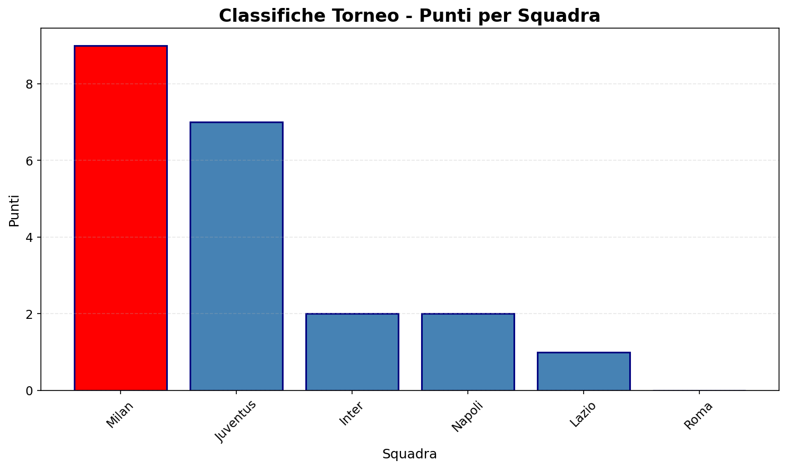

# Verifica su Package Python e Matplotlib

## Consegna
Consegna **due elementi**:
- Il file `cognome.py` rinominato con il tuo cognome (es. `rossi.py`) — contiene il `main()`
- La cartella `torneo/` — il package con i moduli

Struttura finale da consegnare:
```
rossi.py
torneo/
    __init__.py
    squadre.py
    partite.py
```

Testa il codice eseguendo `python rossi.py`.

> **Nota:** `partite.py` deve importare da `squadre.py` usando un import relativo:
> `from .squadre import aggiorna_statistiche`

---

## Esercizio: Gestione Torneo Calcio

Realizzi un package Python che modella un **torneo di calcio** con **squadre** e **partite** giocate.

### Modulo `squadre.py`

Una squadra è rappresentata da un dizionario con:
- `nome`: nome della squadra
- `città`: città di provenienza
- `giocatori`: numero di giocatori in rosa
- `vittorie`: numero di partite vinte
- `pareggi`: numero di pareggi
- `sconfitte`: numero di partite perse
- `gol_segnati`: totale goal fatti
- `gol_subiti`: totale goal subiti

**Funzioni da implementare:**

1. **`crea_squadra(nome, città, giocatori)`**  
   Crea una squadra con statistiche iniziali a 0.

2. **`info_squadra(squadra)`**  
   Restituisce una stringa formattata con tutte le informazioni della squadra.  
   Es: `"Inter (Milano) | 10 gol | 25 vittorie, 3 pareggi, 2 sconfitte"`

3. **`punti_squadra(squadra)`**  
   Calcola i punti totali: vittorie * 3 + pareggi * 1.

4. **`differenza_reti(squadra)`**  
   Calcola la differenza tra gol segnati e gol subiti.

5. **`aggiorna_statistiche(squadra, gol_fatti, gol_subiti)`**  
   Aggiorna i dati della squadra dopo una partita:
   - Se `gol_fatti > gol_subiti`: +1 vittoria
   - Se `gol_fatti == gol_subiti`: +1 pareggio
   - Se `gol_fatti < gol_subiti`: +1 sconfitta
   - Aggiorna gol segnati e subiti

### Modulo `partite.py`

Una partita è rappresentata da un dizionario con:
- `squadra1`: nome squadra 1
- `squadra2`: nome squadra 2
- `gol1`: gol segnati da squadra1
- `gol2`: gol segnati da squadra2
- `data`: data della partita (stringa "YYYY-MM-DD")

**Funzioni da implementare:**

1. **`crea_partita(squadra1, squadra2, gol1, gol2, data)`**  
   Crea una partita.

2. **`info_partita(partita)`**  
   Restituisce stringa formattata.  
   Es: `"Inter 2 - 1 Milan (2026-05-07)"`

3. **`giocate_per_squadra(partite, nome_squadra)`**  
   Restituisce numero di partite giocate da una squadra.

4. **`gol_totali_squadra(partite, nome_squadra)`**  
   Restituisce gol segnati da una squadra in tutte le partite.

6. **`applica_partita(squadre, partita)`**  
   Aggiorna le statistiche di due squadre dopo una partita.  
   Cerca le squadre per nome e chiama `aggiorna_statistiche` per entrambe.

### File principale `cognome.py`

Nel `main()`:
1. Crea almeno 6 squadre di città diverse.
2. Crea almeno 8 partite tra queste squadre.
3. Per ogni partita, usa `applica_partita()` per aggiornare le squadre.
4. Stampa le informazioni di tutte le squadre.
5. Visualizza un istogramma con i punti di ogni squadra.

**Dati di test da usare nel `main()`:**

```python
# 6 squadre
s1 = crea_squadra("Inter", "Milano", 23)
s2 = crea_squadra("Milan", "Milano", 22)
s3 = crea_squadra("Juventus", "Torino", 25)
s4 = crea_squadra("Roma", "Roma", 20)
s5 = crea_squadra("Napoli", "Napoli", 21)
s6 = crea_squadra("Lazio", "Roma", 19)

squadre = [s1, s2, s3, s4, s5, s6]

# 8 partite (almeno)
p1 = crea_partita("Milan", "Inter", 2, 1, "2026-04-01")
p2 = crea_partita("Juventus", "Roma", 3, 0, "2026-04-02")
p3 = crea_partita("Napoli", "Lazio", 2, 2, "2026-04-03")
p4 = crea_partita("Inter", "Juventus", 1, 1, "2026-04-08")
p5 = crea_partita("Milan", "Roma", 2, 0, "2026-04-09")
p6 = crea_partita("Napoli", "Juventus", 1, 2, "2026-04-10")
p7 = crea_partita("Milan", "Lazio", 3, 1, "2026-04-15")
p8 = crea_partita("Inter", "Napoli", 1, 1, "2026-04-16")

partite = [p1, p2, p3, p4, p5, p6, p7, p8]
```

---

## Requisiti

- ✅ Codice pulito con commenti concisi
- ✅ Nessun errore durante l'esecuzione (`python rossi.py`)
- ✅ Grafico istogramma leggibile (punti per squadra)
- ✅ Import relativi corretti tra i moduli
- ✅ Funzioni che gestiscono i casi limite (liste vuote, nomi non trovati, ecc.)

---

## Output atteso

```
CLASSIFICHE FINALI:
- Milan (Milano) | 7 gol | 3V, 0P, 0S | Punti: 9
- Juventus (Torino) | 5 gol | 1V, 2P, 0S | Punti: 5
- Inter (Milano) | 3 gol | 0V, 2P, 1S | Punti: 2
- Napoli (Napoli) | 3 gol | 0V, 2P, 1S | Punti: 2
- Roma (Roma) | 0 gol | 0V, 0P, 2S | Punti: 0
- Lazio (Roma) | 1 gol | 0V, 1P, 1S | Punti: 1
```

**Istogramma atteso:**


